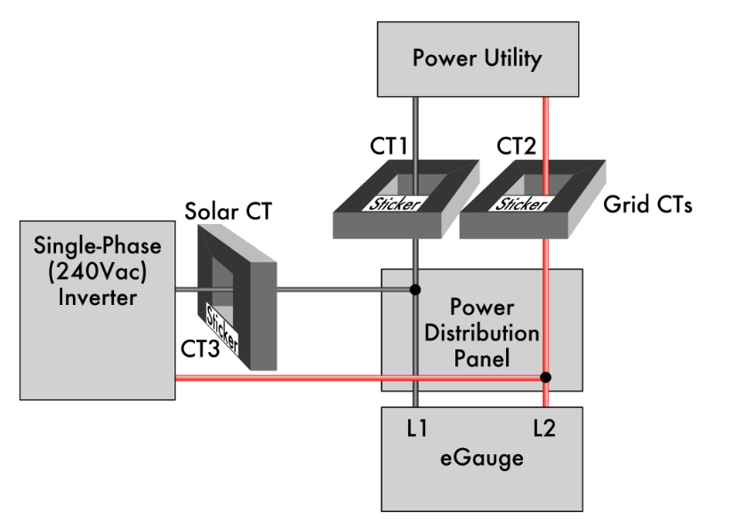
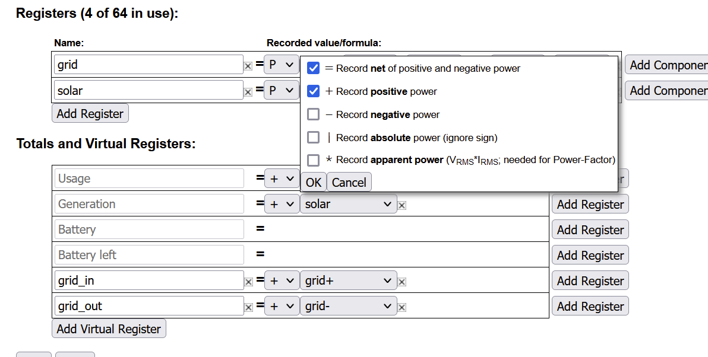
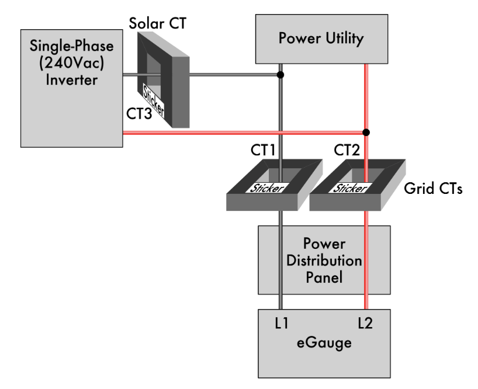
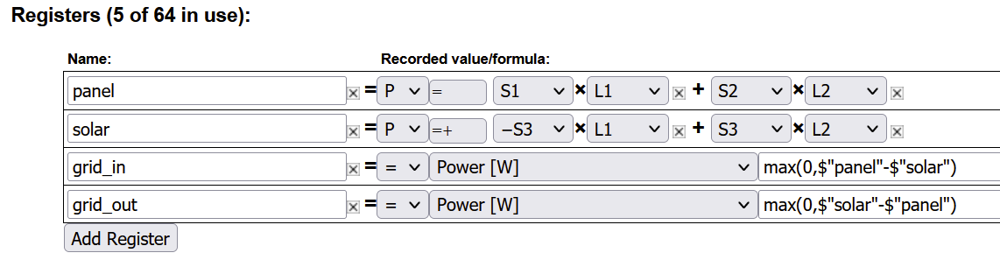

# eGauge

## Features

This component will set up sensors to track both instantaneous and historical data from
an eGauge monitor. It also integrates with Home Assistant's energy dashboard.

### Instantaneous data sensors

These show current rate of change for eGauge registers. In the most common usage, these will
show current power usage in Watts, but other register types are supported.

Supported Instantanous Register Types:

- Humidity
- Temperature
- Power
- Pressure
- Current
- Voltage

### Historical data sensors

These show historical usage over various time periods. Currently, this component only supports
historical data for Power register types. In this case, the component reports total energy
over several time periods, in kWh.

### Sensors created

A set of sensors is created for each real and virtual register configured on the eGauge
monitor.

Note: Due to quirks of the eGauge API, the total usage and generation registers
are named slightly differently depending on whether instantaneous or historical data
is being considered. Instantaneous usage and generation registers are called `use` and `gen`,
while historical registers for the same quantities are called `total_usage` and
`total_generation`.

- `sensor.egauge_<register_name>`
- `sensor.egauge_todays_<register_name>`
- `sensor.egauge_daily_<register_name>`
- `sensor.egauge_weekly_<register_name>`
- `sensor.egauge_monthly_<register_name>`
- `sensor.egauge_yearly_<register_name>`

Note that the `todays` and `daily` registers are different. The `todays` registers report
usage since midnight local time, while the `daily` registers report useage in the previous
24 hours.

### Energy dashboard

Integrate with Home Assistant's energy dashboard using the `todays` registers. Note that
the Home Assistant dashboard wants slightly different measurements than eGauge meters
are normally configured to produce. While eGauge meters are usually configured to measure
net usage, Home Assistant wants separate sensors for energy consumed and generated. Luckily,
it is fairly straightforward to configure your eGauge to produce these measurements.

The necessary configuration depends on how your system was installed. You'll need to make
changes in the "Installation" section of your eGauge settings.

The below diagrams and instructions are assembled from When in doubt, use the guide as an authoritative source.

**Energy dashboard configuration for back-fed solar**



Here, you have a sensor measuring power to and from the grid. All we need to do is to make sure that the eGauge is recording versions of this measurement that record energy in and out, in addition to the net,
then configure some virtual registers to report the values.



**Energy dashboard configuration for direct-feed solar**



In this setup, we have sensors measuring solar production and total usage by the main panel, but we have to do a little math to figure out how much we're drawing from or producing to the grid. We can do this using template sensors in eGauge. Note I think you need a recent version of the eGauge firmware(4.2.x is known to work).



**Other setups**
Consult the [eGauge configuration guide](https://www.egauge.net/media/support/docs/config-guide.pdf).
Feel free to open a pull request with instructions for your setup if you think it may be helpful for
others.

## Installation

### Home Asssistant Community Store (preferred)

1. Install [HACS][hacs] if you haven't already
2. Open the Integrations view in the HACS web UI
3. Click Add Repositories
4. Search for eGauge
5. Click Install

Note: this component should be added to the default list soon, which will make this process
even easier.

### Manual

1. Using the tool of choice open the directory (folder) for your HA configuration (where you find `configuration.yaml`).
2. If you do not have a `custom_components` directory (folder) there, you need to create it.
3. In the `custom_components` directory (folder) create a new folder called `egauge`.
4. Download _all_ the files from the `custom_components/egauge/` directory (folder) in this repository.
5. Place the files you downloaded in the new directory (folder) you created.
6. Restart Home Assistant
7. In the HA UI go to "Configuration" -> "Integrations" click "+" and search for "eGauge"

Using your HA configuration directory (folder) as a starting point you should now also have this:

```text
custom_components/egauge/translations/en.json
custom_components/egauge/__init__.py
custom_components/egauge/config_flow.py
custom_components/egauge/const.py
custom_components/egauge/manifest.json
custom_components/egauge/sensor.py
```

## Configuration is done in the UI

- **eGauge URL**: Enter the URL you use to access your eGauge monitor. This may be a hostname
  such as `http://egauge12345`, an IP address such as `http://192.168.123.123`, or an address
  proxied through eGauge's servers, such as `http://egauge12345.d.egauge.net`. Note that setting
  up access through eGauge's proxy servers introduces a cloud dependency.
- **Username**: Username used to log in to your eGauge. Leave this blank if your device
  doesn't have authentication enabled.
- **Password**: Password used to log in to your eGauge. Leave this blank if your device
  doesn't have authentication enabled.

## Contributions are welcome!

If you want to contribute to this please read the [Contribution guidelines](CONTRIBUTING.md)

## Credits

This project was generated from [@oncleben31](https://github.com/oncleben31)'s [Home Assistant Custom Component Cookiecutter](https://github.com/oncleben31/cookiecutter-homeassistant-custom-component) template.

Code template was mainly taken from [@Ludeeus](https://github.com/ludeeus)'s [integration_blueprint][integration_blueprint] template

---

[integration_blueprint]: https://github.com/custom-components/integration_blueprint
[black]: https://github.com/psf/black
[hacs]: https://hacs.xyz
[exampleimg]: example.png
[maintenance-shield]: https://img.shields.io/badge/maintainer-%40neggert-blue.svg?style=for-the-badge
[releases]: https://github.com/neggert/egauge/releases
[user_profile]: https://github.com/neggert
